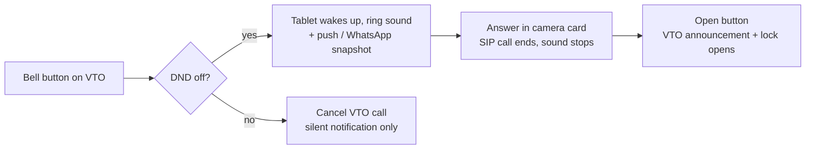

# Dahua VTO + Home Assistant: Asterisk (AMI), go2rtc, Fully Kiosk tablet and SwitchBot Lock Ultra

> **Thank you, [@felipecrs](https://github.com/felipecrs)!**
> This setup is built on top of [felipecrs/dahua-vto-on-home-assistant](https://github.com/felipecrs/dahua-vto-on-home-assistant). The go2rtc stream layout, the `fix_vto_codecs.sh` idea, the Advanced Camera Card approach and the "cancel the VTO call first" trick all come from your repo — it saved me many evenings. Below is my variant in case it helps others: Asterisk controlled via **AMI** instead of the REST callback, a **Fully Kiosk** wall tablet with screensaver/wake logic, a **SwitchBot Lock Ultra** opened from the same button, custom **voice announcements** on the VTO, and notes for a **standalone go2rtc** (no Frigate) and the **DHI-VTO2202F-P-S3**.

**Status**

| Part | State |
| --- | --- |
| My setup: Dahua VTO2202F, go2rtc inside Frigate, Asterisk in an LXC, Fully Kiosk on a Fire tablet, SwitchBot Lock Ultra | running daily |
| Standalone go2rtc add-on (no Frigate) | documented, not tested by me |
| DHI-VTO2202F-P-S3 specifics | from the datasheet, not tested |
| Voice announcements via `audio.cgi?action=postAudio` | template from a third-party write-up, not tested by me |

Placeholders like `<HA_IP>`, `<VTO_IP>`, `<ASTERISK_IP>`, `<TABLET_IP>`, `<VTO_USER>`, `<VTO_PASSWORD>`, `<AMI_USER>`, `<AMI_PASSWORD>`, `<FULLY_PASSWORD>`, `<VTO_DEVICE_ID>`, `<LOCK_MAC>` must be replaced with your values. Entity IDs are from my (German) installation — rename them to yours. Put passwords in `secrets.yaml`.

---

## 1. Overview

When someone rings, the wall tablet rings, you get live video with two-way audio, and one button opens the door: the VTO relay fires, the VTO plays an announcement and the SwitchBot lock unlatches.

| Component | Role |
| --- | --- |
| Dahua VTO (VTO2202F; notes for DHI-VTO2202F-P-S3) | Door station: camera, bell button, SIP, door relay |
| Asterisk (own LXC/server) | SIP server: receives the VTO call, ring group, do-not-disturb |
| go2rtc (inside Frigate, or standalone add-on) | Doorbell stream incl. two-way audio (WebRTC) |
| Fire tablet with Fully Kiosk Browser | Wall panel: panel dashboard, ring sound, screensaver |
| SwitchBot Lock Ultra + Keypad | Front-door lock via MQTT |
| Zigbee door contact + mmWave presence sensor | Door open/closed, wake the tablet on presence |



The DND switch decides whether the tablet rings; opening always goes through the same button.

---

## 2. Prerequisites

| Type | Name | Purpose |
| --- | --- | --- |
| Add-on | Mosquitto broker | MQTT for lock and Zigbee |
| Add-on | SwitchBot-Mqtt ([hsakoh/switchbot-mqtt](https://github.com/hsakoh/switchbot-mqtt)) | Lock Ultra via MQTT |
| Add-on | Zigbee2MQTT | Door contact, presence sensor |
| Integration | Fully Kiosk Browser | Tablet control (screensaver, start URL, foreground app) |
| Integration (HACS) | Dahua ([rroller/dahua](https://github.com/rroller/dahua)) | VTO: bell button, invite, `dahua.vto_cancel_call` |
| Add-on / Frigate | go2rtc | Live video + two-way audio |
| Integration | Generic Camera (standalone go2rtc only) | `camera.doorbell` for snapshots |
| Integration (HACS) | Home Assistant Web Proxy ([dermotduffy/hass-web-proxy-integration](https://github.com/dermotduffy/hass-web-proxy-integration)) (standalone go2rtc only) | lets the camera card reach go2rtc through HA over HTTPS |
| Integration | SwitchBot (Bluetooth) | optional, BLE lock entity as fallback |
| Card (HACS) | Advanced Camera Card **8.x** | video, two-way audio, call button, card automations |
| Card (HACS) | button-card, card-mod | round buttons on both dashboards |
| External | Asterisk | SIP server for the VTO |
| Optional | WhatsApp add-on, Companion app | snapshot and push on ring |

Fully Kiosk: enable **Remote Administration** and set a password — the REST commands below need it.

---

## 3. SwitchBot Lock Ultra

The lock runs through the SwitchBot-Mqtt add-on. A template lock `lock.hausture` combines state and actions so automations and the dashboard only need one entity.

| Entity (my names) | Purpose |
| --- | --- |
| `sensor.lock_ultra_rohstatus` | raw lock state from MQTT (`locked` / `unlocked` / `halfLocked`) |
| `button.lock_entsperren` / `button.lock_sperren` | unlock / lock |
| `button.update_<lock_mac>` | poll the state manually |
| `lock.eingangsbereich_lock_udm` | lock from the SwitchBot BLE integration (fallback) |

**MQTT raw state + template lock** (`configuration.yaml`) — `halfLocked` counts as locked:

```yaml
mqtt:
  sensor:
    - name: "Lock Ultra Rohstatus"
      unique_id: switchbot_lock_rawstate
      state_topic: "switchbot/<LOCK_MAC>/status"
      value_template: "{{ value_json.lockState }}"

template:
  - lock:
      - name: "Haustüre"
        unique_id: switchbot_lock_haustuer
        state: >
          
          {{ 'locked' if s in ['locked', 'halfLocked'] else 'unlocked' }}
        lock:
          - action: button.press
            target:
              entity_id: button.lock_sperren
        unlock:
          - action: button.press
            target:
              entity_id: button.lock_entsperren
        open:
          - action: button.press
            target:
              entity_id: button.lock_entsperren

  - binary_sensor:
      # on = unlocked, off = locked (device_class lock)
      - name: "Lock Ultra Ist Geschlossen"
        unique_id: lock_ultra_is_locked
        state: >
          {{ states('sensor.lock_ultra_rohstatus') not in ['locked', 'halfLocked'] }}
        availability: >
          {{ states('sensor.lock_ultra_rohstatus') not in ['unknown', 'unavailable'] }}
        device_class: lock
```

**Automation — poll after every change** (the MQTT state sometimes lags):

```yaml
alias: SwitchBot Lock poll after action
triggers:
  - trigger: state
    entity_id: sensor.lock_ultra_rohstatus
    for: "00:00:03"
actions:
  - action: button.press
    target:
      entity_id: button.update_<lock_mac>
mode: single
```

**Automation — watchdog for the BLE integration** (reload when the lock is `unknown` for 15 s):

```yaml
alias: SwitchBot Lock sync watchdog
triggers:
  - trigger: state
    entity_id: lock.eingangsbereich_lock_udm
    to: unknown
    for: "00:00:15"
actions:
  - action: homeassistant.reload_config_entry
    target:
      entity_id: lock.eingangsbereich_lock_udm
mode: single
```

---

## 4. Doorbell (Dahua VTO + Asterisk)

The Dahua integration exposes the bell button as `binary_sensor.<vto>_button_pressed` and the running SIP call as `binary_sensor.<vto>_invite`. All doorbell automations hang off these two sensors. `input_boolean.tuerklingel_sound_aktiv` is the do-not-disturb switch (off = quiet).

**Helpers** (Settings → Helpers): `input_boolean.tuerklingel_sound_aktiv`, `input_button.tuer_oeffnen_vto`.

### 4.1 Shell commands

The door opens via the VTO's CGI. Asterisk is controlled through the **Asterisk Manager Interface (AMI, port 5038)**: the active call of the VTO extension (`PJSIP/8001`) is redirected to the dialplan context `answer-hangup`; DND sets a global variable `DND` that the dialplan evaluates. This replaces the REST callback from felipecrs' repo and needs no SSH.

```yaml
shell_command:
  # fire the VTO door relay (the VTO plays its "unlocked" sound)
  vto_oeffnen_mit_ansage: 'curl --digest -u <VTO_USER>:<VTO_PASSWORD> "http://<VTO_IP>/cgi-bin/accessControl.cgi?action=openDoor&channel=1"'

  # redirect the active VTO call (PJSIP/8001) to answer-hangup = end the call
  asterisk_answer: >
    python3 -c "import socket,time,re; s=socket.socket(); s.connect(('<ASTERISK_IP>',5038)); s.sendall(b'Action: Login\r\nUsername: <AMI_USER>\r\nSecret: <AMI_PASSWORD>\r\n\r\n'); time.sleep(0.5); s.recv(4096); s.sendall(b'Action: Command\r\nCommand: core show channels\r\n\r\n'); time.sleep(0.5); data=s.recv(4096).decode(); match=re.search(r'Output:\s+(PJSIP/8001-\S+)', data, re.MULTILINE); ch=match.group(1) if match else None; s.sendall(('Action: Command\r\nCommand: channel redirect ' + ch + ' answer-hangup,1000,1\r\n\r\n').encode()) if ch else None; time.sleep(0.5); print(s.recv(4096).decode()) if ch else print('No channel found'); s.sendall(b'Action: Logoff\r\n\r\n'); s.close()"

  # set global DND=1 / DND=0 in Asterisk
  asterisk_dnd_on: >
    python3 -c "import socket,time; s=socket.socket(); s.connect(('<ASTERISK_IP>',5038)); s.sendall(b'Action: Login\r\nUsername: <AMI_USER>\r\nSecret: <AMI_PASSWORD>\r\n\r\nAction: SetVar\r\nVariable: DND\r\nValue: 1\r\n\r\nAction: Logoff\r\n\r\n'); time.sleep(1); print(s.recv(4096).decode()); s.close()"

  asterisk_dnd_off: >
    python3 -c "import socket,time; s=socket.socket(); s.connect(('<ASTERISK_IP>',5038)); s.sendall(b'Action: Login\r\nUsername: <AMI_USER>\r\nSecret: <AMI_PASSWORD>\r\n\r\nAction: SetVar\r\nVariable: DND\r\nValue: 0\r\n\r\nAction: Logoff\r\n\r\n'); time.sleep(1); print(s.recv(4096).decode()); s.close()"
```

Change `8001` to your VTO's SIP extension.

### 4.2 Custom announcement on the VTO

The "announcement" when opening comes from the VTO itself: `openDoor` fires the relay and the VTO plays its **Unlocked** sound. Replace it (and the ring sound) with your own voice file:

1. Record the file (phone recording or a TTS output).
2. Shrink it — the VTO takes **MP3**, and files must be tiny (about **20 KB** is reported for Dahua VTOs). Mono, 8 kHz, 16 kbit/s is enough for speech, ≈10 s in 20 KB:

   ```bash
   ffmpeg -i announcement.wav -ac 1 -ar 8000 -b:a 16k door_open.mp3
   ```

3. Upload: VTO web UI → **Local Setting → Upload File** (*Audio* on some firmware). Assign it to **Unlocked** (opening) or **Calling/Ring**.
4. Enable it under **Security → Audio Control**.
5. Test by pressing the open button in HA.

Menu names and the size limit vary by firmware.

#### Announcements on demand (postAudio)

Other voice messages ("please leave the parcel at the door", "we're coming") are played on the VTO speaker from HA through `audio.cgi?action=postAudio`. The file lives in HA and is streamed to the VTO.

| | Event sound (web UI) | Announcement on demand (postAudio) |
| --- | --- | --- |
| Triggered by | VTO event (unlocked, ring) | HA shell command (button, automation) |
| Stored | on the VTO | in HA, e.g. `/config/www/vto/` |
| Format | MP3 | **raw G.711A (A-law), extension `.al`** |
| Sample rate / channels | mono, 8 kHz recommended | **8000 Hz, mono** — required |
| Size | about 20 KB per file | 8 KB per second (64 kbit/s); up to ~6 s / 50 KB is fine |

```bash
ffmpeg -i parcel.wav -ar 8000 -ac 1 -acodec pcm_alaw -f alaw parcel.al
```

```yaml
shell_command:
  vto_announcement_parcel: >
    curl --anyauth -u <VTO_USER>:<VTO_PASSWORD>
    --limit-rate 8K --connect-timeout 5 --max-time 10 --no-keepalive
    -H "Content-Type: Audio/G.711A" -H "Content-Length: 9999999"
    --data-binary @/config/www/vto/parcel.al
    "http://<VTO_IP>/cgi-bin/audio.cgi?action=postAudio&httptype=singlepart&channel=1"
```

`--limit-rate 8K` sends the file at real-time speed so the VTO does not drop the beginning; `--max-time` must be a bit longer than the clip. The speaker is busy during an active two-way-audio session — play announcements after hanging up. Source: [Custom audio with Dahua VTO and HA (antanaitis.lt)](https://antanaitis.lt/2025/06/14/running-custom-audio-through-a-dahua-poe-ip-doorbell-camera-using-home-assistant/).

### 4.3 Asterisk configuration

The VTO registers as SIP extension 8001 and dials 1000 when the button is pressed. Two variants:

| Variant | What rings | What you need |
| --- | --- | --- |
| **A — with FRITZ!Box** | all DECT/FRITZ!Fon phones (ring group `**9`) **and** the browser/tablet endpoint `hassosvto` | IP phone `vto2fritz` in the FRITZ!Box |
| **B — without FRITZ!Box** | only `hassosvto` (plus tablet sound and push from HA) | nothing extra |

**`/etc/asterisk/pjsip.conf` (variant A):**

```ini
; ---------- transports ----------
[transport-wss]
type=transport
protocol=wss
bind=0.0.0.0:8089
cert_file=/etc/asterisk/keys/asterisk.pem
priv_key_file=/etc/asterisk/keys/asterisk-key.pem

[transport-udp]
type=transport
protocol=udp
bind=0.0.0.0

; ---------- VTO (extension 8001) ----------
[8001]
type = endpoint
context = from-vto
disallow = all
allow = alaw,ulaw
allow = h264
direct_media_method = invite
dtmf_mode = info
callerid = "Doorbell" <8001>
force_rport = no
aors = 8001
auth = auth8001

[8001]
type = aor
max_contacts = 1

[auth8001]
type = auth
auth_type = userpass
username = 8001
password = <SIP_PASSWORD_VTO>

; ---------- FRITZ!Box (create IP phone "vto2fritz" in the FRITZ!Box) ----------
[vto2fritz]
type=endpoint
transport=transport-udp
context=to-fritz
disallow=all
allow=alaw
allow=ulaw
outbound_auth=vto2fritz-auth
aors=vto2fritz-aor
from_user=vto2fritz
from_domain=fritz.box
direct_media=no
asymmetric_rtp_codec=yes

[vto2fritz-auth]
type=auth
auth_type=userpass
username=vto2fritz
password=<FRITZ_SIP_PASSWORD>

[vto2fritz-aor]
type=aor
contact=sip:<FRITZBOX_IP>

[vto2fritz-reg]
type=registration
outbound_auth=vto2fritz-auth
server_uri=sip:<FRITZBOX_IP>
client_uri=sip:vto2fritz@<FRITZBOX_IP>
retry_interval=60
forbidden_retry_interval=600
expiration=3600
transport=transport-udp

; ---------- hassosvto: WebRTC endpoint for the browser ----------
[hassosvto]
type=endpoint
context=from-internal
disallow=all
allow=opus,ulaw,alaw
auth=hassosvto-auth
aors=hassosvto-aor
rtp_symmetric=yes
rewrite_contact=yes
force_rport=yes
direct_media=no
transport=transport-wss
webrtc=yes
use_avpf=yes
ice_support=yes
media_encryption=dtls
dtls_verify=no
dtls_setup=actpass
dtls_cert_file=/etc/asterisk/keys/asterisk.pem
dtls_private_key=/etc/asterisk/keys/asterisk-key.pem

[hassosvto-auth]
type=auth
auth_type=userpass
username=hassosvto
password=<HASSOSVTO_PASSWORD>

[hassosvto-aor]
type=aor
max_contacts=1
remove_existing=yes

[hassosvto-identify]
type=identify
endpoint=hassosvto
match=<HA_IP>
```

In the VTO web UI (Network → SIP Server) enter Asterisk as server, user 8001 with the password above, and 1000 as the number for the bell button.

**`/etc/asterisk/manager.conf`** — AMI only from the HA IP:

```ini
[general]
enabled = yes
port = 5038
bindaddr = 0.0.0.0

[<AMI_USER>]
secret = <AMI_PASSWORD>
deny = 0.0.0.0/0.0.0.0
permit = <HA_IP>/255.255.255.255
read = all
write = all
```

**`/etc/asterisk/extensions.conf` (variant A):**

```ini
[globals]
DND=0

[from-vto]
exten => 1000,1,NoOp(Call from VTO - ring group)
same => n,GotoIf($["${DND}" = "1"]?dnd)
same => n,Set(CALLERID(num)=1)
same => n,Set(CALLERID(name)=Door)
same => n,Dial(PJSIP/**9@vto2fritz&PJSIP/hassosvto,30)
same => n,Hangup()
same => n(dnd),NoOp(DND active - busy)
same => n,Busy(5)

[to-fritz]
exten => 2000,1,NoOp(Call from FRITZ!Box - to VTO)
same => n,Dial(PJSIP/8001,30)
same => n,Hangup()

; target of shell_command.asterisk_answer: end the call cleanly
[answer-hangup]
exten => 1000,1,Answer()
same => n,Hangup()
```

**Variant B — without FRITZ!Box:** drop `[vto2fritz]`, `[vto2fritz-auth]`, `[vto2fritz-aor]`, `[vto2fritz-reg]` from `pjsip.conf` and `[to-fritz]` from `extensions.conf`; in `[from-vto]` dial only `PJSIP/hassosvto,30`. Everything in HA stays the same.

Reload after changes (`asterisk -rvvv`): `pjsip reload`, `manager reload`, `dialplan reload`.

### 4.4 go2rtc

**Inside Frigate (my setup)** — with felipecrs' `fix_vto_codecs.sh` in front of each source:

```yaml
go2rtc:
  streams:
    doorbell:
      # HD video straight from the VTO (Frigate record)
      - echo:/config/scripts/fix_vto_codecs.sh rtsp://<VTO_USER>:<VTO_PASSWORD>@<VTO_IP>/cam/realmonitor?channel=1&subtype=0#media=video
      # audio via loopback from doorbell_sd (no extra VTO connection)
      - rtsp://127.0.0.1:8554/doorbell_sd?audio=pcma&backchannel=0
      - rtsp://127.0.0.1:8554/doorbell_sd?audio=aac&backchannel=0
    doorbell_sd:
      # SD video + AAC (Frigate detect, both dashboards)
      - echo:/config/scripts/fix_vto_codecs.sh rtsp://<VTO_USER>:<VTO_PASSWORD>@<VTO_IP>/cam/realmonitor?channel=1&subtype=1#backchannel=0
      # audio + backchannel (ONVIF) - the VTO allows only ONE backchannel, so it lives here
      - echo:/config/scripts/fix_vto_codecs.sh rtsp://<VTO_USER>:<VTO_PASSWORD>@<VTO_IP>/cam/realmonitor?channel=1&subtype=0&unicast=true&proto=Onvif#media=audio#backchannel=1
```

Why this layout: the dashboards (Fire tablet, phone) play the light SD stream with two-way audio, Frigate still records in HD, and the VTO sees exactly **3 connections** (HD video, SD video, ONVIF audio/backchannel) no matter how many viewers are open — go2rtc shares producers. Don't loop both ways (`doorbell` ⇄ `doorbell_sd`), or the streams will feed each other.

**Standalone go2rtc (no Frigate) and DHI-VTO2202F-P-S3 (untested)** — according to the [datasheet](https://www.dahuasecurity.com/products/video-intercoms/2-wire-ip/villa-door-station/pro-series/vto2202f-p-s3) the S3 offers audio only as G.711a/G.711u/PCM, **no AAC** — so the codec script (which sets the sub stream to AAC) would likely fail. Instead:

1. In the VTO web UI set audio **on**, codec **G.711A**, **8000 Hz** for main and sub stream.
2. Add the repository `https://github.com/AlexxIT/hassio-addons`, install and start the **go2rtc** add-on.
3. `/config/go2rtc.yaml`:

   ```yaml
   streams:
     doorbell:
       - rtsp://<VTO_USER>:<VTO_PASSWORD>@<VTO_IP>/cam/realmonitor?channel=1&subtype=0#media=video
       - rtsp://127.0.0.1:8554/doorbell_sd?audio=pcma&backchannel=0
     doorbell_sd:
       - rtsp://<VTO_USER>:<VTO_PASSWORD>@<VTO_IP>/cam/realmonitor?channel=1&subtype=1#media=video
       - rtsp://<VTO_USER>:<VTO_PASSWORD>@<VTO_IP>/cam/realmonitor?channel=1&subtype=0&unicast=true&proto=Onvif#media=audio#backchannel=1
   ```

4. Test at `http://<HA_IP>:1984` → stream `doorbell_sd` → video, audio, microphone.
5. Camera entity: **Generic Camera** with `rtsp://<HA_IP>:8554/doorbell_sd`, name "Doorbell" → `camera.doorbell`.
6. Install **Home Assistant Web Proxy** (HACS) so the camera card proxies go2rtc through HA over HTTPS.

### 4.5 Scripts

```yaml
vto_tur_offnen_komplett:
  alias: VTO open door (complete)
  sequence:
    - action: shell_command.vto_oeffnen_mit_ansage
    - action: shell_command.asterisk_answer
      continue_on_error: true
    - action: lock.open
      target:
        entity_id: lock.hausture
  mode: single

doorbell_answered:          # doorbell_hangup is identical
  alias: Doorbell answered
  sequence:
    - parallel:
        - action: shell_command.asterisk_answer
          continue_on_error: true
        - action: rest_command.fully_kiosk_stopsound
          continue_on_error: true
  mode: single

# optional: remote-control the camera card (e.g. physical button next to the tablet)
doorbell_answer_full:
  alias: Doorbell - answer (full)
  sequence:
    - action: custom:advanced-camera-card-action
      data:
        advanced_camera_card_action: call_start
    - action: custom:advanced-camera-card-action
      data:
        advanced_camera_card_action: microphone_unmute
    - action: script.doorbell_answered
  mode: single

doorbell_hangup_full:
  alias: Doorbell - hang up (full)
  sequence:
    - action: custom:advanced-camera-card-action
      data:
        advanced_camera_card_action: call_stop
    - action: custom:advanced-camera-card-action
      data:
        advanced_camera_card_action: microphone_mute
    - action: script.doorbell_hangup
  mode: single
```

### 4.6 Automations

**Open the door (master button):**

```yaml
alias: "Front door master: open & VTO announcement"
triggers:
  - trigger: state
    entity_id: input_button.tuer_oeffnen_vto
actions:
  - action: shell_command.asterisk_answer
    continue_on_error: true
  - action: shell_command.vto_oeffnen_mit_ansage
  - action: lock.open
    target:
      entity_id: lock.hausture
  - action: dahua.vto_cancel_call
    target:
      device_id: <VTO_DEVICE_ID>
    continue_on_error: true
  - action: rest_command.fully_kiosk_stopsound
mode: single
```

**Keep DND in sync with Asterisk:**

```yaml
alias: Asterisk DND sync
triggers:
  - trigger: state
    entity_id: input_boolean.tuerklingel_sound_aktiv
    to: "off"
    id: dnd_on
  - trigger: state
    entity_id: input_boolean.tuerklingel_sound_aktiv
    to: "on"
    id: dnd_off
  - trigger: homeassistant
    event: start
    id: ha_start
actions:
  - choose:
      - conditions:
          - condition: trigger
            id: dnd_on
        sequence:
          - action: shell_command.asterisk_dnd_on
      - conditions:
          - condition: trigger
            id: dnd_off
        sequence:
          - action: shell_command.asterisk_dnd_off
      - conditions:
          - condition: trigger
            id: ha_start
        sequence:
          - if:
              - condition: state
                entity_id: input_boolean.tuerklingel_sound_aktiv
                state: "off"
            then:
              - action: shell_command.asterisk_dnd_on
            else:
              - action: shell_command.asterisk_dnd_off
mode: single
```

**Phone notification** (vibrate twice, then a persistent notification linking to the intercom dashboard):

```yaml
alias: Doorbell phone notification
triggers:
  - trigger: state
    entity_id: binary_sensor.<vto>_button_pressed
    from: "off"
    to: "on"
actions:
  - repeat:
      count: 2
      sequence:
        - action: notify.mobile_app_<your_phone>
          data:
            message: Someone is at the door!
            data:
              tag: "vibration-{{ repeat.index }}"
              push:
                sound: doorbell.wav
        - delay: "00:00:01.5"
  - repeat:
      count: 2
      sequence:
        - action: notify.mobile_app_<your_phone>
          data:
            message: clear_notification
            data:
              tag: "vibration-{{ repeat.index }}"
  - action: notify.mobile_app_<your_phone>
    data:
      message: Visitor at the front door!
      data:
        tag: doorbell-final
        url: /dashboard-intercom/0
        push:
          sound: doorbell.wav
mode: restart
```

**Snapshot + WhatsApp** (optional, WhatsApp add-on):

```yaml
alias: Doorbell - WhatsApp
triggers:
  - trigger: state
    entity_id: binary_sensor.<vto>_button_pressed
    from: "off"
    to: "on"
actions:
  - action: camera.snapshot
    target:
      entity_id: camera.doorbell
    data:
      filename: /config/www/tmp/doorbell.jpg
  - delay: "00:00:02"
  - action: whatsapp.send_message
    data:
      clientId: default
      to: <WHATSAPP_GROUP_ID>@g.us
      body:
        image:
          url: /config/www/tmp/doorbell.jpg
        caption: Someone is at the door!
mode: restart
```

---

## 5. Fully Kiosk tablet

The tablet shows the panel dashboard (`/dashboard-panel`) permanently, sleeps with a black screensaver and wakes up on presence or ring. The Fully Kiosk integration provides `switch.<tablet>_bildschirmschoner` (screensaver), `button.<tablet>_start_url_laden` (reload start URL), `binary_sensor.<tablet>_kiosk_modus` (kiosk mode) and `sensor.<tablet>_vordergrund_app` (foreground app); sound and screensaver are also driven via the Fully REST API.

**REST commands** (`configuration.yaml`, port 2323 = Fully Remote Admin):

```yaml
rest_command:
  fully_kiosk_playsound:
    url: "http://<TABLET_IP>:2323?password=<FULLY_PASSWORD>&cmd=playSound&url={{ url }}"
    method: GET
  fully_kiosk_stopsound:
    url: "http://<TABLET_IP>:2323?password=<FULLY_PASSWORD>&cmd=stopSound"
    method: GET
  fully_screensaver_start:
    url: "http://<TABLET_IP>:2323?password=<FULLY_PASSWORD>&cmd=startScreensaver"
    method: GET
  fully_screensaver_stop:
    url: "http://<TABLET_IP>:2323?password=<FULLY_PASSWORD>&cmd=stopScreensaver"
    method: GET
  # optional: media volume max / mute
  tablet_volume_max:
    url: "http://<TABLET_IP>:2323?password=<FULLY_PASSWORD>&cmd=execCommand&command=media%20volume%20--stream%203%20--set%2015"
    method: GET
  tablet_volume_mute:
    url: "http://<TABLET_IP>:2323?password=<FULLY_PASSWORD>&cmd=execCommand&command=media%20volume%20--stream%203%20--set%200"
    method: GET
```

Put the ring sound at `/config/www/doorbell.mp3` → `https://<HA_IP>:8123/local/doorbell.mp3`.

**Ring: wake the tablet and play the sound** (only when DND is off):

```yaml
alias: Fully doorbell - ring and wake
triggers:
  - trigger: state
    entity_id: binary_sensor.<vto>_button_pressed
    from: "off"
    to: "on"
conditions:
  - condition: state
    entity_id: input_boolean.tuerklingel_sound_aktiv
    state: "on"
actions:
  - parallel:
      - sequence:
          - if:
              - condition: state
                entity_id: switch.<tablet>_bildschirmschoner
                state: "on"
            then:
              - action: rest_command.fully_screensaver_stop
                continue_on_error: true
              - action: switch.turn_off
                target:
                  entity_id: switch.<tablet>_bildschirmschoner
      - action: rest_command.fully_kiosk_playsound
        data:
          url: https://<HA_IP>:8123/local/doorbell.mp3
mode: restart
```

**Stop the sound** on door open, end of the SIP invite, or answer in the card:

```yaml
alias: Fully sound stop
triggers:
  - trigger: state
    entity_id: binary_sensor.<vto>_invite
    from: "on"
    to: "off"
  - trigger: state
    entity_id: binary_sensor.<front_door_contact>
    to: "on"
  - trigger: state
    entity_id: script.doorbell_answered
    to: "on"
actions:
  - parallel:
      - action: shell_command.asterisk_answer
        continue_on_error: true
      - action: rest_command.fully_kiosk_stopsound
        continue_on_error: true
mode: restart
```

**Do not disturb** (cancel the VTO call, silent notification only):

```yaml
alias: Doorbell - do not disturb
triggers:
  - trigger: state
    entity_id: binary_sensor.<vto>_button_pressed
    from: "off"
    to: "on"
conditions:
  - condition: state
    entity_id: input_boolean.tuerklingel_sound_aktiv
    state: "off"
actions:
  - parallel:
      - action: dahua.vto_cancel_call
        target:
          device_id: <VTO_DEVICE_ID>
        continue_on_error: true
      - action: rest_command.fully_kiosk_stopsound
        continue_on_error: true
  - action: notify.persistent_notification
    data:
      title: "DND: doorbell suppressed"
      message: Someone rang, but the sound was disabled.
mode: parallel
```

**Screensaver by presence** (wake on mmWave presence or door open; sleep after 15 s without presence, never during a call):

```yaml
alias: Fully - screensaver stop on activity
triggers:
  - trigger: state
    entity_id: binary_sensor.<presence_entrance>
    from: "off"
    to: "on"
  - trigger: state
    entity_id: binary_sensor.<front_door_contact>
    from: "off"
    to: "on"
conditions:
  - condition: state
    entity_id: switch.<tablet>_bildschirmschoner
    state: "on"
actions:
  - action: rest_command.fully_screensaver_stop
    continue_on_error: true
  - action: switch.turn_off
    target:
      entity_id: switch.<tablet>_bildschirmschoner
mode: restart
```

```yaml
alias: Fully - screensaver start after idle
triggers:
  - trigger: state
    entity_id: binary_sensor.<presence_entrance>
    to: "off"
    for:
      seconds: 15
actions:
  - condition: state
    entity_id: binary_sensor.<vto>_invite
    state: "off"
  - action: rest_command.fully_screensaver_start
    continue_on_error: true
  - action: switch.turn_on
    target:
      entity_id: switch.<tablet>_bildschirmschoner
mode: single
```

**Maintenance** (reload the start URL daily at 04:00, when Fully loses focus for 30 s, and when the camera comes back):

```yaml
alias: Fully - maintenance
triggers:
  - trigger: time
    at: "04:00:00"
  - trigger: state
    entity_id: sensor.<tablet>_vordergrund_app
    not_to: de.ozerov.fully
    for:
      seconds: 30
  - trigger: state
    entity_id: camera.doorbell
    from: unavailable
actions:
  - action: button.press
    target:
      entity_id: button.<tablet>_start_url_laden
mode: parallel
```

**Reload when go2rtc is back** (at most every 5 min). Needs the helper `input_datetime.fully_letzter_reload` (date + time) and a go2rtc health sensor:

```yaml
# rest.yaml  (configuration.yaml: rest: !include rest.yaml)
- resource: http://<GO2RTC_IP>:1984/api/streams
  scan_interval: 5
  sensor:
    - name: "go2rtc Streams Status"
      unique_id: go2rtc_streams_status
      value_template: >
        
          online
        
          offline
        
```

```yaml
# configuration.yaml
template:
  - binary_sensor:
      - name: "go2rtc Verbindung"
        unique_id: go2rtc_healthy
        state: "{{ states('sensor.go2rtc_streams_status') == 'online' }}"
        device_class: connectivity
```

```yaml
alias: Fully browser reload on go2rtc
triggers:
  - trigger: state
    entity_id: binary_sensor.go2rtc_verbindung
    to: "on"
    id: online
  - trigger: homeassistant
    event: start
    id: ha_start
actions:
  - choose:
      - conditions:
          - condition: trigger
            id: online
          - condition: template
            value_template: >
              {{ (as_timestamp(now()) - as_timestamp(states('input_datetime.fully_letzter_reload'), 0)) > 300 }}
        sequence:
          - delay: "00:00:10"
          - action: input_datetime.set_datetime
            target:
              entity_id: input_datetime.fully_letzter_reload
            data:
              datetime: "{{ now().strftime('%Y-%m-%d %H:%M:%S') }}"
          - action: button.press
            target:
              entity_id: button.<tablet>_start_url_laden
      - conditions:
          - condition: trigger
            id: ha_start
        sequence:
          - delay: "00:02:00"
          - action: button.press
            target:
              entity_id: button.<tablet>_start_url_laden
mode: restart
```

**Self-healing: reload the start URL after a connection drop** (uses the same helper `input_datetime.fully_letzter_reload`):

```yaml
alias: Fully Kiosk - reload after connection loss
triggers:
  - trigger: state
    entity_id: binary_sensor.<tablet>_kiosk_modus
    from: unavailable
    for:
      seconds: 10
conditions:
  - condition: template
    value_template: >
      {{ (as_timestamp(now()) - as_timestamp(states('input_datetime.fully_letzter_reload'), 0)) > 300 }}
actions:
  - action: input_datetime.set_datetime
    target:
      entity_id: input_datetime.fully_letzter_reload
    data:
      datetime: "{{ now().strftime('%Y-%m-%d %H:%M:%S') }}"
  - action: button.press
    target:
      entity_id: button.<tablet>_start_url_laden
mode: single
```

---

## 6. Dashboards

Two storage-mode dashboards are involved. Create them under Settings → Dashboards → *Add dashboard* → ⋮ → *Raw configuration editor* and paste the YAML.

| Dashboard | URL | Used on | Content |
| --- | --- | --- | --- |
| **Panel** | `/dashboard-panel` | Fully Kiosk wall tablet (start URL) | black full-screen layout: doorbell camera with call/mic buttons (120 px), temperature/humidity/power gauges, analog clock, alarm + DND buttons, alarm panel, hourly weather, auto-list of open contacts and lights that are on |
| **Intercom** | `/dashboard-intercom` | phone (push notification opens it) | DND / light / alarm buttons, doorbell camera with call button, open / lock / door-state buttons |

Both camera cards use the same logic: live + two-way audio only, green call button while idle/ringing, and on *answered* the card cancels the VTO SIP call (`dahua.vto_cancel_call`) and runs `script.doorbell_answered`; on hang-up it runs `script.doorbell_hangup`. Both cards play `doorbell_sd` (the stream that owns the backchannel) and connect the microphone only during a call (`always_connected: false`) — keeping it permanently connected left stale backchannel sessions in go2rtc and made the Fire tablet stream unstable. The panel uses `modes: [webrtc, mse]` so it falls back to MSE if WebRTC fails. Tested with **Advanced Camera Card 8.x**.

Required frontend cards (HACS): Advanced Camera Card, button-card, card-mod, layout-card (`custom:grid-layout`), auto-entities, Mushroom (alarm panel). The weather card uses the theme `minimalist-ios-tapbar` — remove the `theme:` line if you don't have it.

For a **standalone go2rtc** add `url: http://<HA_IP>:1984` under `go2rtc:` in both camera cards (see 4.4). Entity IDs are from my setup — adjust `light.eingang`, the alarm automations, `alarm_control_panel.alarm`, the temperature sensors and the door contact to yours.

<details>
<summary><b>Panel dashboard (Fully Kiosk tablet) — full YAML</b></summary>

```yaml
title: Panel
views:
  - title: Panel
    type: custom:grid-layout
    card_mod:
      style: |
        /* General rules for the whole dashboard */
        ha-card {
          box-shadow: none !important;
          border: none !important;
          background: none !important;
        }
        :host {
          /* Sets the dashboard background to pure black */
          --primary-background-color: #000000;
          --ha-card-border-width: 0;
          --ha-card-box-shadow: none;
          --ha-card-background: #000000;
        }
    cards:
      # ---------- doorbell camera ----------
      - type: custom:advanced-camera-card
        cameras:
          - title: doorbell
            camera_entity: camera.doorbell
            live_provider: go2rtc
            go2rtc:
              stream: doorbell_sd
              modes:
                - webrtc
                - mse
            dimensions:
              aspect_ratio_mode: static
              layout:
                fit: fill
        profiles:
          - doorbell
        capabilities:
          disable_except:
            - live
            - 2-way-audio
          force:
            - 2-way-audio
        live:
          preload: true
          show_image_during_load: true
          microphone:
            always_connected: false
            auto_unmute:
              - call
          controls:
            builtin: true
            call:
              enabled: false
              ringtone:
                type: none
        menu:
          position: bottom
          style: outside
          alignment: left
          button_size: 120
          auto_hide: []
          buttons:
            call:
              enabled: true
            microphone:
              enabled: true
              type: toggle
            mute:
              enabled: true
            menu:
              enabled: false
            iris:
              enabled: false
            clips:
              enabled: false
            snapshots:
              enabled: false
            recordings:
              enabled: false
            folders:
              enabled: false
            reviews:
              enabled: false
            media:
              enabled: false
            gallery:
              enabled: false
            media_gallery:
              enabled: false
            timeline:
              enabled: false
            live:
              enabled: false
            image:
              enabled: false
            expand:
              enabled: false
            display_mode:
              enabled: false
            substreams:
              enabled: false
            ptz_home:
              enabled: false
            screenshot:
              enabled: false
            download:
              enabled: false
            fullscreen:
              enabled: false
            media_player:
              enabled: false
            cameras:
              enabled: false
            camera_ui:
              enabled: false
        overrides:
          - conditions:
              - condition: call
                call:
                  - idle
                  - ringing
            merge:
              menu:
                buttons:
                  call:
                    style:
                      color: green
        automations:
          - triggers:
              - trigger: call
                to: answered
            actions:
              - action: perform-action
                perform_action: dahua.vto_cancel_call
                target:
                  device_id: <VTO_DEVICE_ID>
              - action: perform-action
                perform_action: script.doorbell_answered
          - triggers:
              - trigger: call
                from: answered
                to: idle
            actions:
              - action: perform-action
                perform_action: script.doorbell_hangup
        dimensions:
          aspect_ratio_mode: dynamic
        status_bar:
          style: none

      # ---------- gauges, clock, alarm/DND ----------
      - type: horizontal-stack
        cards:
          - type: grid
            square: false
            columns: 2
            cards:
              - type: gauge
                entity: sensor.temperatur_garage_temperature
                name: Garage
                needle: true
                min: -10
                max: 40
                severity:
                  green: 0
                  yellow: 25
                  red: 30
                card_mod:
                  style: |
                    ha-card {
                      box-shadow: none !important;
                      border: none !important;
                      background: transparent !important;
                    }
              - type: gauge
                entity: sensor.temperatur_vorne_temperature
                name: Haustüre
                needle: true
                min: -10
                max: 40
                severity:
                  green: 0
                  yellow: 25
                  red: 30
                card_mod:
                  style: |
                    ha-card {
                      box-shadow: none !important;
                      border: none !important;
                      background: transparent !important;
                    }
              - type: gauge
                entity: sensor.temperatur_vorne_humidity
                name: Humidity
                needle: true
                segments:
                  - from: 0
                    to: 30
                    color: "#b52b35"
                  - from: 30
                    to: 80
                    color: "#3b9444"
                  - from: 80
                    to: 100
                    color: "#3eabde"
                card_mod:
                  style: |
                    ha-card {
                      box-shadow: none !important;
                      border: none !important;
                      background: transparent !important;
                    }
              - type: gauge
                entity: sensor.tasmota_power_curr
                name: Stromverbrauch
                needle: true
                min: -900
                max: 3800
                unit: W
                segments:
                  - from: -900
                    to: -100
                    color: "#3b9444"
                  - from: -100
                    to: -1
                    color: "#90c695"
                  - from: -1
                    to: 1
                    color: "#d32f2f"
                  - from: 1
                    to: 270
                    color: "#3b9444"
                  - from: 270
                    to: 1500
                    color: "#ffa726"
                  - from: 1500
                    to: 3800
                    color: "#d32f2f"
                card_mod:
                  style: |
                    ha-card {
                      box-shadow: none !important;
                      border: none !important;
                      background: transparent !important;
                    }
            card_mod:
              style: |
                ha-card {
                  box-shadow: none !important;
                  border: none !important;
                  background: transparent !important;
                }
                /* Also for inner cards wrapped by the grid */
                #root > div > * {
                  box-shadow: none !important;
                  border: none !important;
                  background: transparent !important;
                }
          - type: clock
            clock_style: analog
            clock_size: large
            show_seconds: true
            seconds_motion: tick
            no_background: false
            border: true
            ticks: minute
            face_style: numbers_upright
            card_mod:
              style: |
                ha-card {
                  box-shadow: none !important;
                  border: none !important;
                  background: transparent !important;
                }
          - type: horizontal-stack
            cards:
              - type: vertical-stack
                cards:
                  - type: grid
                    square: false
                    columns: 2
                    cards:
                      - type: horizontal-stack
                        cards:
                          - type: custom:button-card
                            color_type: blank-card
                            styles:
                              card:
                                - box-shadow: none
                                - background: none
                          - type: custom:button-card
                            entity: automation.alarm_abwesend_aktiv
                            name: Alarm
                            show_state: false
                            show_name: true
                            tap_action:
                              action: call-service
                              service: automation.toggle
                              target:
                                entity_id:
                                  - automation.alarm_abwesend_aktiv
                                  - automation.alarm_nacht_aktiv_neu
                                  - automation.alarm_night_inaktiv_2
                            styles:
                              card:
                                - height: 85px
                                - width: 85px
                                - border-radius: 50%
                                - padding: 5px
                              icon:
                                - width: 85%
                                - height: 85%
                              name:
                                - font-size: 10px
                                - margin-top: 2px
                            state:
                              - value: "off"
                                icon: mdi:alarm-light-off-outline
                                styles:
                                  card:
                                    - background-color: "#9E0000"
                                  icon:
                                    - color: "#FFD700"
                                  name:
                                    - color: white
                              - value: "on"
                                icon: mdi:alarm-light-outline
                                styles:
                                  card:
                                    - background-color: var(--ha-card-background)
                                  icon:
                                    - color: grey
                                  name:
                                    - color: var(--secondary-text-color)
                          - type: custom:button-card
                            color_type: blank-card
                            styles:
                              card:
                                - box-shadow: none
                                - background: none
                        card_mod:
                          style: |
                            ha-card {
                              box-shadow: none !important;
                              border: none !important;
                              background: none !important;
                            }
                      - type: horizontal-stack
                        cards:
                          - type: custom:button-card
                            color_type: blank-card
                            styles:
                              card:
                                - box-shadow: none
                                - background: none
                          - type: custom:button-card
                            entity: input_boolean.tuerklingel_sound_aktiv
                            name: DND
                            show_state: false
                            show_name: true
                            tap_action:
                              action: call-service
                              service: input_boolean.toggle
                              service_data:
                                entity_id: input_boolean.tuerklingel_sound_aktiv
                            styles:
                              card:
                                - height: 85px
                                - width: 85px
                                - border-radius: 50%
                                - padding: 5px
                              icon:
                                - width: 85%
                                - height: 85%
                              name:
                                - font-size: 10px
                                - margin-top: 2px
                            state:
                              - value: "off"
                                icon: mdi:bell-off-outline
                                styles:
                                  card:
                                    - background-color: "#9E0000"
                                  icon:
                                    - color: "#FFD700"
                                  name:
                                    - color: white
                              - value: "on"
                                icon: mdi:bell-outline
                                styles:
                                  card:
                                    - background-color: var(--ha-card-background)
                                  icon:
                                    - color: grey
                                  name:
                                    - color: var(--secondary-text-color)
                          - type: custom:button-card
                            color_type: blank-card
                            styles:
                              card:
                                - box-shadow: none
                                - background: none
                        card_mod:
                          style: |
                            ha-card {
                              box-shadow: none !important;
                              border: none !important;
                              background: none !important;
                            }
                    card_mod:
                      style: |
                        ha-card {
                          box-shadow: none !important;
                          border: none !important;
                          background: none !important;
                        }
                  - type: custom:mushroom-alarm-control-panel-card
                    entity: alarm_control_panel.alarm
                    states:
                      - armed_away
                      - armed_night
                      - armed_custom_bypass
                    layout: vertical
                    icon_type: icon
                    card_mod:
                      style: |
                        ha-card {
                          box-shadow: none !important;
                          border: none !important;
                          background: none !important;
                        }
                card_mod:
                  style: |
                    ha-card {
                      box-shadow: none !important;
                      border: none !important;
                      background: none !important;
                    }
            card_mod:
              style: |
                ha-card {
                  box-shadow: none !important;
                  border: none !important;
                  background: none !important;
                }
        card_mod:
          style: |
            ha-card {
              box-shadow: none !important;
              border: none !important;
              background: transparent !important;
            }
            div#root > div > ha-card {
              box-shadow: none !important;
              border: none !important;
              background: transparent !important;
            }

      # ---------- weather ----------
      - type: horizontal-stack
        cards:
          - type: weather-forecast
            entity: weather.<your_weather>
            show_current: false
            show_forecast: true
            forecast_type: hourly
            forecast_slots: 12
            secondary_info_attribute: pressure
            theme: minimalist-ios-tapbar
            card_mod:
              style: |
                ha-card {
                  box-shadow: none !important;
                  border: none !important;
                  background: none !important;
                }
        card_mod:
          style: |
            ha-card {
              box-shadow: none !important;
              border: none !important;
              background: none !important;
            }

      # ---------- open contacts + lights on ----------
      - type: custom:auto-entities
        card:
          type: glance
          show_name: true
          show_state: true
          columns: 4
          card_mod:
            style: |
              ha-card {
                background: transparent !important;
                box-shadow: none !important;
                border: none !important;
                --ha-card-background: transparent;
                --ha-card-border-width: 0px;
                --ha-card-border-color: transparent;
                --ha-card-box-shadow: none;
              }
        card_mod:
          style: |
            ha-card {
              background: transparent !important;
              box-shadow: none !important;
              border: none !important;
              --ha-card-background: transparent;
              --ha-card-border-width: 0px;
              --ha-card-border-color: transparent;
              --ha-card-box-shadow: none;
            }
        filter:
          include:
            - domain: light
              state: "on"
              options:
                tap_action:
                  action: toggle
            - domain: binary_sensor
              entity_id: "*contact*"
              state: "on"
          exclude:
            - entity_id: binary_sensor.ture_garage_auf_contact
            - entity_id: light.presence_simulation_light
          sort:
            method: domain
            reverse: false
          show_empty: false
```

</details>

<details>
<summary><b>Intercom dashboard (phone) — full YAML</b></summary>

```yaml
title: Intercom
views:
  - title: Haustür
    path: intercom
    icon: mdi:doorbell-video
    cards:
      # ---------- DND / light / alarm ----------
      - type: grid
        square: false
        columns: 1
        cards:
          - type: horizontal-stack
            cards:
              - type: custom:button-card
                entity: input_boolean.tuerklingel_sound_aktiv
                name: DND
                show_state: false
                show_name: true
                tap_action:
                  action: call-service
                  service: input_boolean.toggle
                  service_data:
                    entity_id: input_boolean.tuerklingel_sound_aktiv
                styles:
                  card:
                    - height: 68px
                    - width: 68px
                    - border-radius: 50%
                    - padding: 5px
                  icon:
                    - width: 85%
                    - height: 85%
                  name:
                    - font-size: 10px
                    - margin-top: 2px
                state:
                  - value: "off"
                    icon: mdi:bell-off-outline
                    styles:
                      card:
                        - background-color: "#9E0000"
                      icon:
                        - color: "#FFD700"
                      name:
                        - color: white
                  - value: "on"
                    icon: mdi:bell-outline
                    styles:
                      card:
                        - background-color: var(--ha-card-background)
                      icon:
                        - color: grey
                      name:
                        - color: var(--secondary-text-color)
              - type: custom:button-card
                color_type: blank-card
                styles:
                  card:
                    - box-shadow: none
                    - background: none
              - type: custom:button-card
                entity: light.eingang
                name: Licht
                show_state: false
                show_name: true
                tap_action:
                  action: call-service
                  service: light.toggle
                  service_data:
                    entity_id: light.eingang
                styles:
                  card:
                    - height: 68px
                    - width: 68px
                    - border-radius: 50%
                    - padding: 5px
                    - background-color: var(--ha-card-background)
                  icon:
                    - width: 85%
                    - height: 85%
                  name:
                    - font-size: 10px
                    - margin-top: 2px
                    - color: var(--secondary-text-color)
                state:
                  - value: "off"
                    icon: mdi:lightbulb-off
                    styles:
                      icon:
                        - color: var(--secondary-text-color)
                  - value: "on"
                    icon: mdi:lightbulb
                    styles:
                      icon:
                        - color: "#FFD700"
              - type: custom:button-card
                color_type: blank-card
                styles:
                  card:
                    - box-shadow: none
                    - background: none
              - type: custom:button-card
                entity: automation.alarm_abwesend_aktiv
                name: Alarm
                show_state: false
                show_name: true
                tap_action:
                  action: call-service
                  service: automation.toggle
                  target:
                    entity_id:
                      - automation.alarm_abwesend_aktiv
                      - automation.alarm_nacht_aktiv_neu
                styles:
                  card:
                    - height: 68px
                    - width: 68px
                    - border-radius: 50%
                    - padding: 5px
                  icon:
                    - width: 85%
                    - height: 85%
                  name:
                    - font-size: 10px
                    - margin-top: 2px
                state:
                  - value: "off"
                    icon: mdi:alarm-light-off-outline
                    styles:
                      card:
                        - background-color: "#9E0000"
                      icon:
                        - color: "#FFD700"
                      name:
                        - color: white
                  - value: "on"
                    icon: mdi:alarm-light-outline
                    styles:
                      card:
                        - background-color: var(--ha-card-background)
                      icon:
                        - color: grey
                      name:
                        - color: var(--secondary-text-color)
            card_mod:
              style: |
                ha-card {
                  box-shadow: none !important;
                  border: none !important;
                  background: none !important;
                }
        card_mod:
          style: |
            ha-card {
              box-shadow: none !important;
              border: none !important;
              background: none !important;
            }

      # ---------- doorbell camera ----------
      - type: custom:advanced-camera-card
        cameras:
          - title: doorbell
            camera_entity: camera.doorbell
            live_provider: go2rtc
            go2rtc:
              stream: doorbell_sd
              modes:
                - webrtc
            dimensions:
              aspect_ratio_mode: static
              layout:
                fit: fill
        profiles:
          - doorbell
        capabilities:
          disable_except:
            - live
            - 2-way-audio
          force:
            - 2-way-audio
        live:
          preload: true
          show_image_during_load: true
          microphone:
            always_connected: false
            auto_unmute:
              - call
          controls:
            builtin: true
            call:
              enabled: false
        menu:
          position: bottom
          style: outside
          alignment: left
          button_size: 70
          auto_hide: []
          buttons:
            call:
              enabled: true
            microphone:
              enabled: true
              type: toggle
            mute:
              enabled: true
            menu:
              enabled: false
            iris:
              enabled: false
            clips:
              enabled: false
            snapshots:
              enabled: false
            recordings:
              enabled: false
            folders:
              enabled: false
            reviews:
              enabled: false
            media:
              enabled: false
            gallery:
              enabled: false
            media_gallery:
              enabled: false
            timeline:
              enabled: false
            live:
              enabled: false
            image:
              enabled: false
            expand:
              enabled: false
            display_mode:
              enabled: false
            substreams:
              enabled: false
            ptz_home:
              enabled: false
            screenshot:
              enabled: false
            download:
              enabled: false
            fullscreen:
              enabled: false
            media_player:
              enabled: false
            cameras:
              enabled: false
            camera_ui:
              enabled: false
        overrides:
          - conditions:
              - condition: call
                call:
                  - idle
                  - ringing
            merge:
              menu:
                buttons:
                  call:
                    style:
                      color: green
        automations:
          - triggers:
              - trigger: call
                to: answered
            actions:
              - action: perform-action
                perform_action: dahua.vto_cancel_call
                target:
                  device_id: <VTO_DEVICE_ID>
              - action: perform-action
                perform_action: script.doorbell_answered
          - triggers:
              - trigger: call
                from: answered
                to: idle
            actions:
              - action: perform-action
                perform_action: script.doorbell_hangup
        dimensions:
          aspect_ratio_mode: dynamic
        status_bar:
          style: none

      # ---------- open / lock / door state ----------
      - type: grid
        square: true
        columns: 3
        cards:
          - type: custom:button-card
            entity: button.lock_entsperren
            aspect_ratio: 1/1
            show_name: true
            show_label: true
            name: open
            label: |
              [[[
                return states['sensor.lock_ultra_rohstatus'].state === 'locked'
                  ? ''
                  : 'unlocked';
              ]]]
            icon: |
              [[[
                return states['binary_sensor.ture_hausture_contact'].state === 'on'
                  ? 'mdi:door-open'
                  : 'mdi:door-closed';
              ]]]
            tap_action:
              action: call-service
              service: automation.trigger
              service_data:
                entity_id: automation.haustur_master_offnen_vto_ansage
            styles:
              card:
                - border-radius: 50%
                - padding: 10%
                - background-color: |
                    [[[
                      return states['sensor.lock_ultra_rohstatus'].state === 'locked'
                        ? 'rgba(128,128,128,0.1)'
                        : 'rgba(0,200,0,0.2)';
                    ]]]
              icon:
                - width: 35%
                - color: |
                    [[[
                      return states['sensor.lock_ultra_rohstatus'].state === 'locked'
                        ? 'grey'
                        : 'green';
                    ]]]
              name:
                - font-size: 13px
                - font-weight: bold
                - text-align: center
              label:
                - font-size: 10px
                - font-style: italic
                - text-align: center
          - type: custom:button-card
            entity: button.lock_sperren
            aspect_ratio: 1/1
            show_name: true
            show_label: true
            name: lock
            label: |
              [[[
                return states['sensor.lock_ultra_rohstatus'].state === 'locked'
                  ? 'locked'
                  : '';
              ]]]
            icon: |
              [[[
                return states['sensor.lock_ultra_rohstatus'].state === 'locked'
                  ? 'mdi:lock'
                  : 'mdi:lock-open-variant';
              ]]]
            tap_action:
              action: call-service
              service: button.press
              target:
                entity_id: button.lock_sperren
            styles:
              card:
                - border-radius: 50%
                - padding: 10%
                - background-color: |
                    [[[
                      return states['sensor.lock_ultra_rohstatus'].state === 'locked'
                        ? 'rgba(255,0,0,0.2)'
                        : 'rgba(128,128,128,0.1)';
                    ]]]
              icon:
                - width: 35%
                - color: |
                    [[[
                      return states['sensor.lock_ultra_rohstatus'].state === 'locked'
                        ? 'red'
                        : 'grey';
                    ]]]
              name:
                - font-size: 13px
                - font-weight: bold
                - text-align: center
              label:
                - font-size: 10px
                - font-style: italic
                - text-align: center
          - type: custom:button-card
            entity: binary_sensor.ture_hausture_contact
            aspect_ratio: 1/1
            show_name: true
            show_label: false
            name: |
              [[[
                return states['binary_sensor.ture_hausture_contact'].state === 'on'
                  ? 'open'
                  : 'closed';
              ]]]
            tap_action:
              action: none
            styles:
              card:
                - border-radius: 50%
                - padding: 10%
                - background-color: |
                    [[[
                      return states['binary_sensor.ture_hausture_contact'].state === 'on'
                        ? 'rgba(0,200,0,0.2)'
                        : 'rgba(255,0,0,0.2)';
                    ]]]
              icon:
                - width: 35%
                - color: |
                    [[[
                      return states['binary_sensor.ture_hausture_contact'].state === 'on'
                        ? 'green'
                        : 'red';
                    ]]]
              name:
                - font-size: 11px
                - text-align: center
            state:
              - value: "on"
                icon: mdi:door-open
              - value: "off"
                icon: mdi:door-closed
```

</details>

---

## 7. Pitfalls & tips

- **Microphone on the tablet:** two-way audio in the browser needs HTTPS. Open HA via HTTPS (Nabu Casa, reverse proxy or own certificate); with standalone go2rtc the card must reach go2rtc through the Web Proxy.
- **VTO2202F-P-S3 and AAC:** the S3 has no AAC per datasheet; set G.711A/8000 Hz in the VTO instead of using the codec script.
- **Only one backchannel:** the VTO allows a single two-way-audio session. If the Dahua integration's camera or a second camera entity also opens a backchannel, two-way audio breaks in HA or the DMSS app ([rroller/dahua#595](https://github.com/rroller/dahua/issues/595)). Use `#backchannel=0` on the sub stream, disable the Dahua camera entities and turn off "Preload stream".
- **Ring sound keeps playing:** the sound loops until a stop automation fires — check door-open, invite-end and answer all call `fully_kiosk_stopsound`.
- **Fully loses focus:** Android occasionally brings other apps to the front; the maintenance automation reloads the start URL after 30 s.
- **Lock state lags:** the Lock Ultra does not always report immediately via MQTT; the poll automation asks again 3 s after every change, the watchdog reloads the BLE integration on `unknown`.
- **Latch vs. bolt:** "open" pulls the latch on the Lock Ultra — the template lock maps `open` to the unlock button, and the dashboard uses the raw state.
- **`device_id`:** `dahua.vto_cancel_call` needs the VTO's device ID (Settings → Devices → VTO, it's in the URL).
- **Secrets:** keep VTO, Fully and AMI passwords in `secrets.yaml`.

---

Thanks again to [@felipecrs](https://github.com/felipecrs) for the groundwork — and to the authors of [rroller/dahua](https://github.com/rroller/dahua), [go2rtc](https://github.com/AlexxIT/go2rtc), [Advanced Camera Card](https://github.com/dermotduffy/advanced-camera-card) and [switchbot-mqtt](https://github.com/hsakoh/switchbot-mqtt). Feedback and corrections are welcome.
